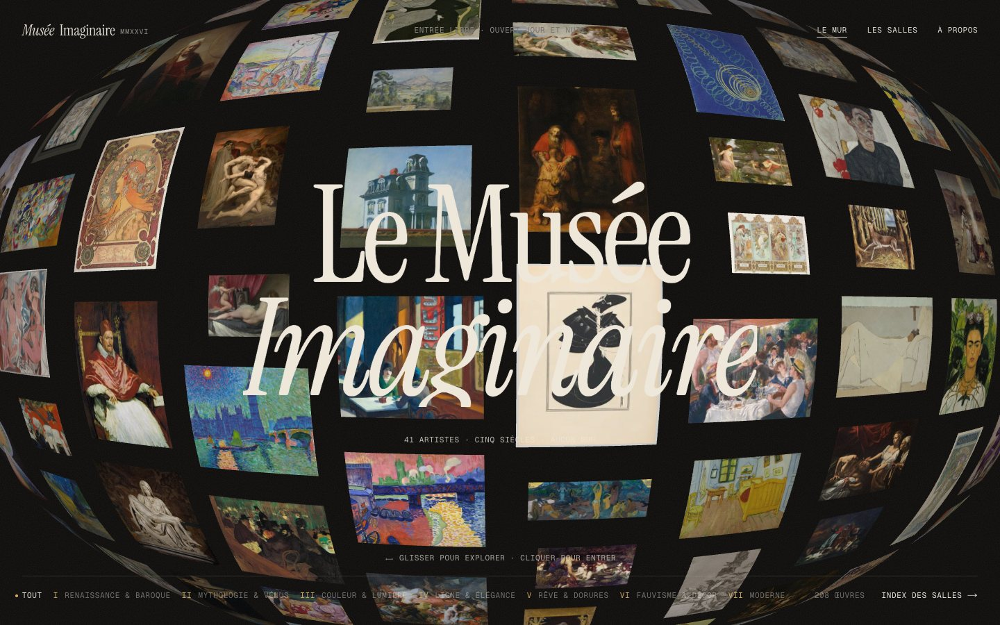
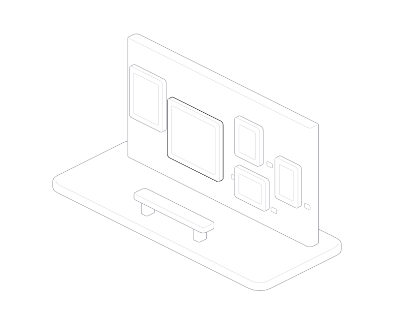
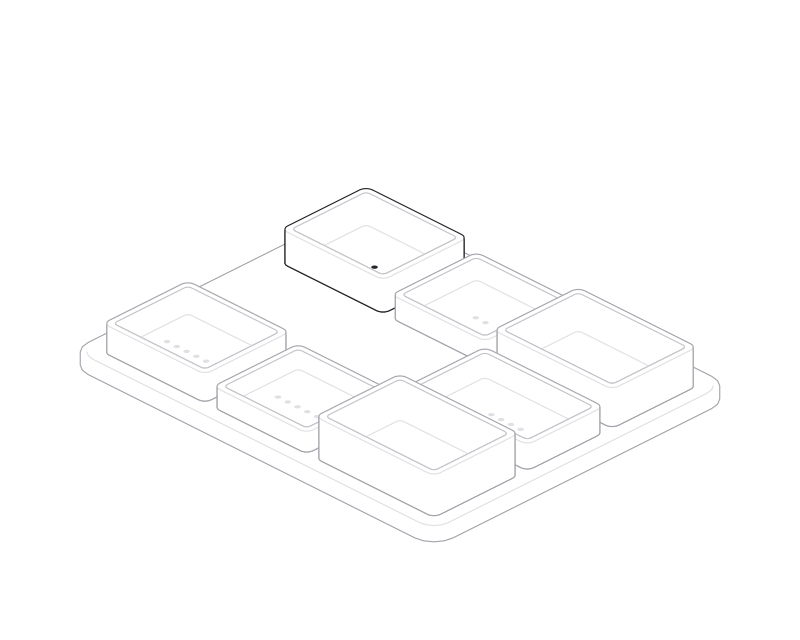
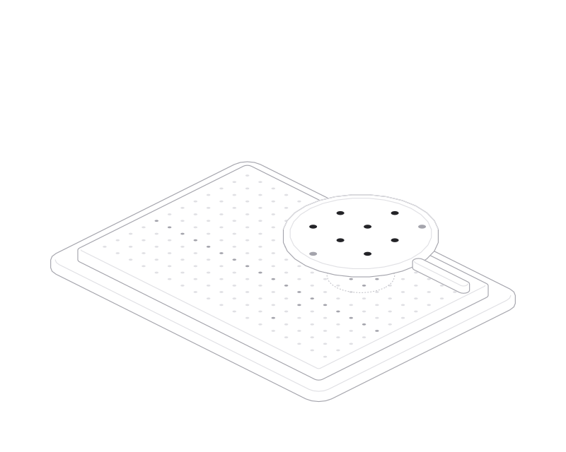
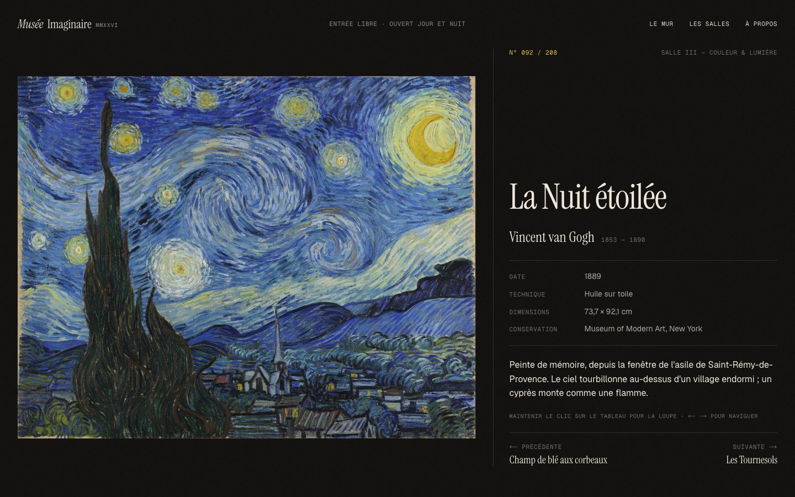
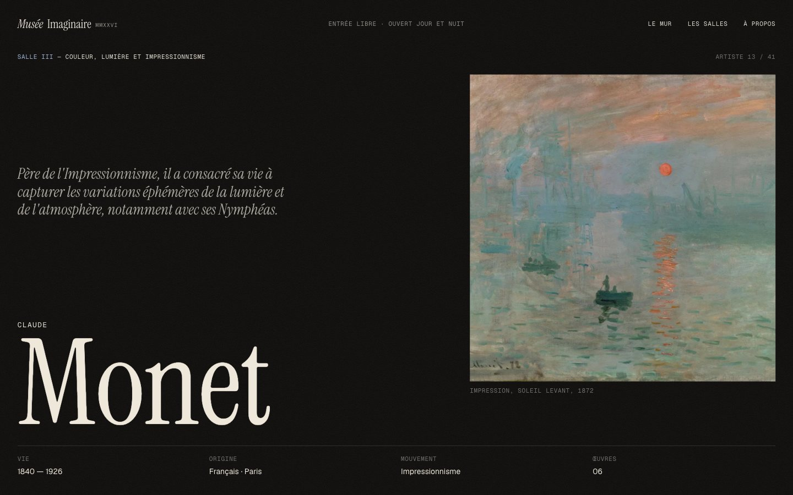

<div align="center">

# Musée Imaginaire

**Une galerie sans murs.** Quarante artistes, deux cent vingt-huit œuvres, sept salles,
de Léonard de Vinci à Jackson Pollock.

[**Visiter le musée →**](https://m-u-c-k-a.github.io/musee-imaginaire/)

Next.js 16 · React Three Fiber / Three.js · GSAP · Lenis · TypeScript

</div>

<br>



---

## L'idée

En 1947, André Malraux publie *Le Musée imaginaire* : grâce à la photographie, chacun peut
désormais réunir dans sa mémoire des œuvres qu'aucun musée ne rassemblera jamais. Ce site est
un musée imaginaire au sens de Malraux : une collection personnelle, accrochée selon des
affinités plutôt que selon l'histoire officielle. Mucha à côté de Modigliani, Hilma af Klint à
côté de Klimt, et Vénus partout, de Botticelli à Bouguereau.

Le parti pris de design tient en trois mots : **sombre, typographique, lent**. Un fond d'encre,
une seule famille de serif (Instrument Serif) pour les noms et les titres, une mono pour les
cartels, et des animations qui prennent leur temps, comme on prend le temps devant un tableau.

## La démarche

Le site se visite en trois gestes : on **embrasse** la collection, on **choisit** une salle,
on **s'approche** d'une œuvre. Chacun a été conçu comme un objet, avant d'être un écran.

### 1. Embrasser — le Mur

<picture>
  <source media="(prefers-color-scheme: dark)" srcset="docs/figures/salon-dark.svg">
  
</picture>

L'accueil est un accrochage « à la salon », comme au XIXᵉ siècle : toutes les œuvres sur une
seule paroi, sans hiérarchie. En pratique, c'est **une scène WebGL** de 228 plans texturés,
disposés en colonnes qui bouclent dans les deux axes : on peut glisser à l'infini.

- **La courbure.** Le vertex shader repousse chaque sommet en profondeur selon sa distance au
  centre (`z -= courbure × r²`). Le mur devient un globe, et la courbure s'accentue avec la
  vitesse de défilement. Les tableaux se tendent dans le sens du mouvement et leurs couches RVB
  se séparent légèrement : on sent l'inertie sans la voir.
- **Le survol.** Le tableau survolé s'avance, s'avive, reçoit un liseré ivoire et un reflet qui
  le traverse ; les autres reculent à peine. Le test de survol est fait sur le processeur, avec
  la *même* projection que le shader, contre la pose de repos du tableau : une zone de survol
  qui bougerait avec l'animation ferait clignoter l'image.
- **Le zoom.** Au clic, le plan WebGL vole jusqu'à l'emplacement exact où la page de l'œuvre
  affichera le tableau. Une image fixe prend le relais pendant le changement de route, puis
  s'efface quand la vraie image est chargée. Le JavaScript et le CSS partagent la même
  géométrie (`src/lib/layout.ts`), si bien que la transition est sans couture.

### 2. Choisir — les Salles

<picture>
  <source media="(prefers-color-scheme: dark)" srcset="docs/figures/plan-dark.svg">
  
</picture>

La collection est rangée en sept salles, chacune avec son texte d'introduction :

| | Salle | Artistes |
| --- | --- | --- |
| I | La Renaissance et le Baroque | Léonard de Vinci, Michel-Ange, Le Caravage, Rembrandt, Vermeer, Velázquez, Goya |
| II | Beauté charnelle, Mythologie et Vénus | Les Vénus (collection), Cabanel, Bouguereau, Delacroix, Waterhouse |
| III | Couleur, Lumière et Impressionnisme | Monet, Cézanne, Renoir, Degas, Morisot, Gauguin, Van Gogh |
| IV | Art Nouveau, Ligne et Élégance | Mucha, Toulouse-Lautrec, Beardsley, Modigliani |
| V | Mysticisme, Rêve et Dorures | Klimt, Hilma af Klint, Redon, Schiele, Moreau, Chagall |
| VI | Fauvisme et Décoration | Matisse, Bonnard, Vuillard, Derain |
| VII | L'Art Moderne et Contemporain | Picasso, Kandinsky, Mondrian, Dalí, Magritte, Kahlo, Hopper, Pollock |

Chaque artiste a sa page : une couleur d'accent tirée de sa palette, une biographie, une
citation quand elle est sûre, et ses œuvres accrochées sur une **cimaise horizontale** que le
défilement fait glisser. Les tableaux y sont des plans WebGL calés sur leurs balises ``,
qui se courbent comme une toile tendue quand on fait défiler vite. L'image HTML reste dans la
page pour le référencement, l'accessibilité et les navigateurs sans WebGL.

Tout le contenu (bios, cartels, dates, lieux de conservation) est écrit en français dans
`src/data/salles/`, une salle par fichier.

### 3. S'approcher — le cartel et la loupe

<picture>
  <source media="(prefers-color-scheme: dark)" srcset="docs/figures/loupe-dark.svg">
  
</picture>

Chaque œuvre a sa page, composée comme un mur de musée : le tableau à gauche, le **cartel** à
droite (titre, artiste, date, technique, dimensions, lieu de conservation, notice). En
maintenant le clic sur le tableau, une **loupe** grossit la version haute définition (2400 px)
sous le curseur ; les flèches ← → passent à l'œuvre suivante.



### 4. Le mouvement

- **Un seul battement.** Lenis lisse le défilement, GSAP cadence tout, et le rendu Three.js est
  déclenché à la main (`frameloop="never"` + `advance()`) juste après Lenis, dans la même image :
  le DOM et le WebGL ne se décalent jamais d'une frame.
- **Les transitions.** Un rideau à bord courbe (un tracé SVG interpolé) monte avec le nom de la
  destination, la route change dessous, puis le rideau se lève et la page s'écrit : titres
  découpés en lettres ou en lignes avec SplitText, images révélées de bas en haut par le shader.
- **Le préchargement** compte de vraies choses : les polices, puis les textures du Mur.
- Un curseur sur mesure, un grain animé, et `prefers-reduced-motion` respecté partout.



### 5. Les images

Les reproductions viennent de Wikimedia Commons et de Wikipédia, via un petit pipeline :

| Étape | Commande | Ce qu'elle fait |
| --- | --- | --- |
| Résoudre | `pnpm art:fetch` | Chaque œuvre déclare une source (`wiki:`, `file:`, `search:`) ; le script trouve le fichier, sa licence et son auteur, et télécharge une version de 1920 px |
| Décliner | `pnpm art:process` | Trois tailles WebP : 400 px pour le Mur, 1200 px pour les galeries, 2400 px pour la loupe, plus la couleur dominante et un placeholder flou |
| Créditer | `pnpm art:report` | `credits.csv` : source, licence, résolution de chaque image, et une colonne `a_remplacer` |

Les URL d'images portent une empreinte (`?v=…`) : remplacer un fichier par une version sous
licence suffit à rafraîchir le cache des visiteurs.

## Lancer le projet

```bash
pnpm install
pnpm dev       # http://localhost:3000
pnpm build     # build de production
```

Pour remplacer une image : déposer le fichier dans `.cache/art-src/<slug>.jpg`, puis
`pnpm art:process`. Le slug de chaque œuvre est dans `src/data/salles/`.

## Déploiement

Le site est un **export statique** publié sur GitHub Pages par une GitHub Action
(`.github/workflows/deploy.yml`) à chaque push sur `main`. Le build tourne avec
`GITHUB_PAGES=true` (export dans `out/`) et `NEXT_PUBLIC_BASE_PATH=/musee-imaginaire` (le
préfixe d'un site de projet). Sans ces variables, `pnpm build` produit un site Next.js
classique, déployable tel quel sur Vercel.

## Structure

```
src/
  app/                 routes : /, /salles, /artistes/[slug], /oeuvres/[slug], /a-propos
  components/
    gl/                WebGL : le Mur, les plans calés sur le DOM, le cache de textures
    wall/ artist/ artwork/ salles/ about/
    ui/                préchargement, rideau, curseur, en-tête, révélations de texte
  data/
    salles/            le contenu, une salle par fichier
    images.json        généré : dimensions, couleur, version de chaque image
    credits.json       généré : source et licence de chaque image
  lib/                 GSAP, Lenis, géométrie partagée, store
scripts/               pipeline des images, nettoyage des fichiers ._* (disque exFAT)
docs/figures/          les figures de ce README (sources .js, pages interactives, SVG)
```

## Crédits

- **Reproductions** : Wikimedia Commons et Wikipédia ; la source et la licence de chaque image
  sont listées dans `credits.csv` et sur la page *À propos*. Les droits des œuvres sont gérés
  par l'équipe du projet.
- **Textes** : biographies, introductions de salles et cartels rédigés pour le Musée Imaginaire.
- **Typographie** : Instrument Serif, Geist, Geist Mono.
- **Figures** : dessinées avec [Hairline](https://lucasmarkes.com/lab/hairline), en vue
  isométrique, d'un seul trait. Elles existent aussi en version interactive, qui répond au
  pointeur : [le mur](https://m-u-c-k-a.github.io/musee-imaginaire/figures/hairline-salon.html),
  [le plan](https://m-u-c-k-a.github.io/musee-imaginaire/figures/hairline-plan.html),
  [la loupe](https://m-u-c-k-a.github.io/musee-imaginaire/figures/hairline-loupe.html).
